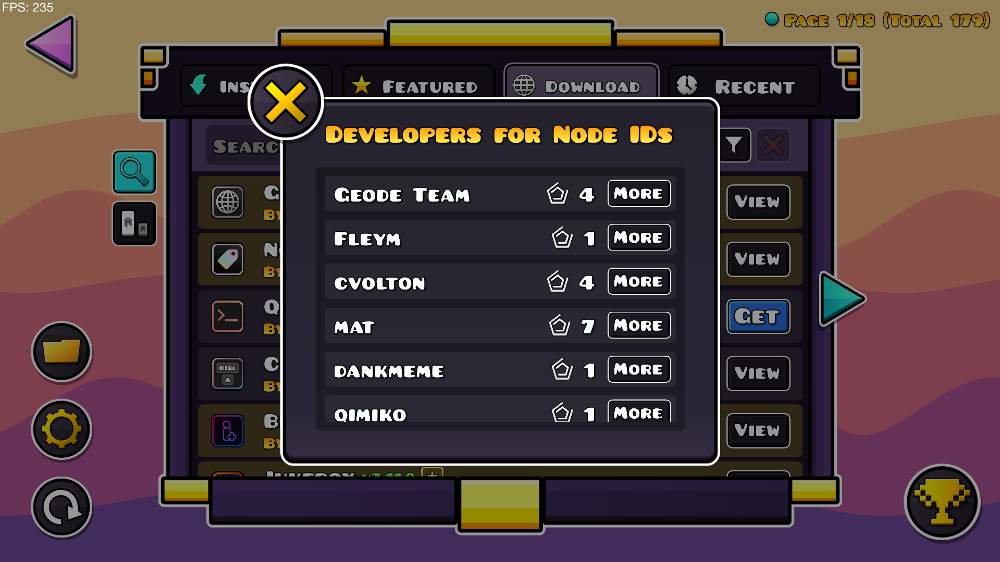
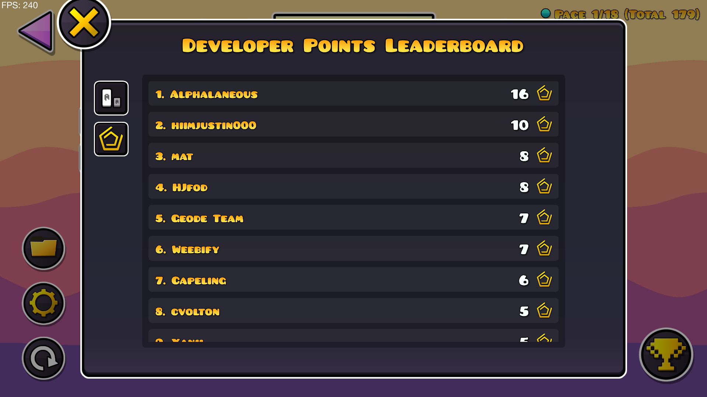

# Index Developers Points
This is where she makes a mod.


A Creator-Points-like system for Geode Mod Developers

## Devs Popup


## Developer Points Leaderboard

- White icon: Number of mods that a developer has on the index
- Gold icon: Number of mods that a developer has on the index + Number of featured mods that they have (so normal mod = +1, featured mod = +2 just like the rating system)


## Getting started
We recommend heading over to [the getting started section on our docs](https://docs.geode-sdk.org/getting-started/) for useful info on what to do next.

## Build instructions
For more info, see [our docs](https://docs.geode-sdk.org/getting-started/create-mod#build)
```sh
# Assuming you have the CLI set up already
geode build
```

# Resources
* [Geode SDK Documentation](https://docs.geode-sdk.org/)
* [Geode SDK Source Code](https://github.com/geode-sdk/geode/)
* [Bindings](https://github.com/geode-sdk/bindings/)
* [Dev Tools](https://github.com/geode-sdk/DevTools)
